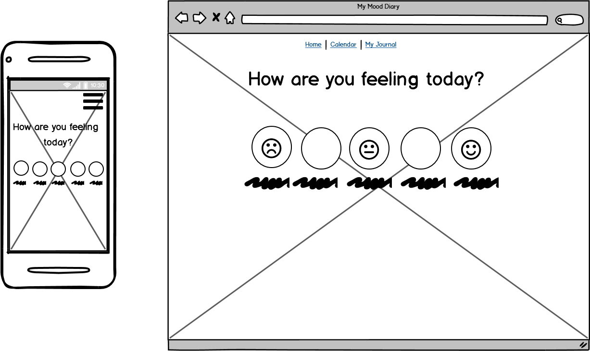
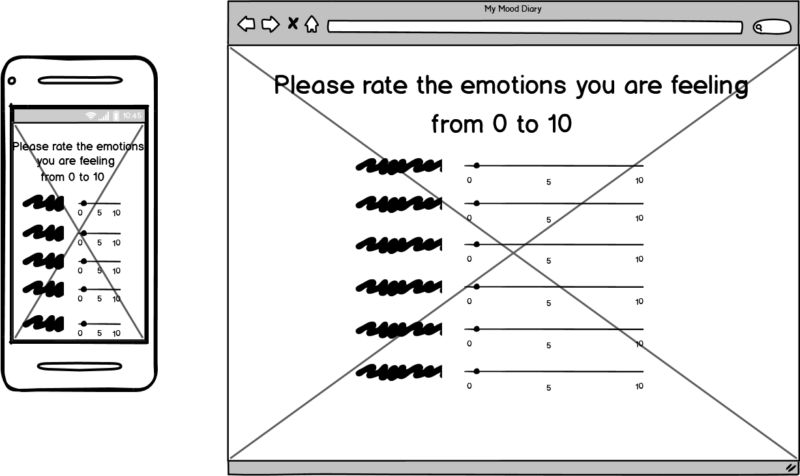
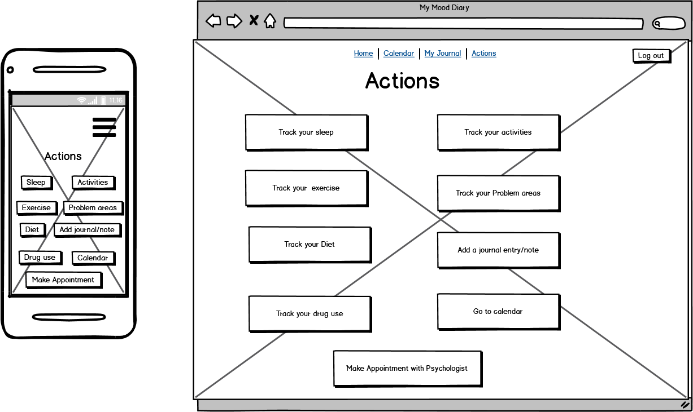
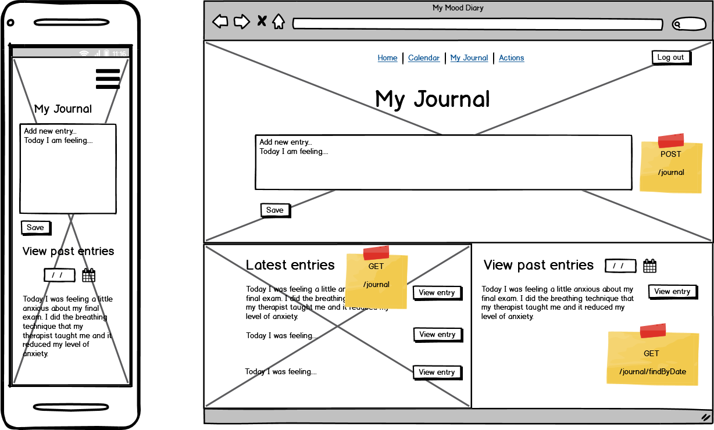
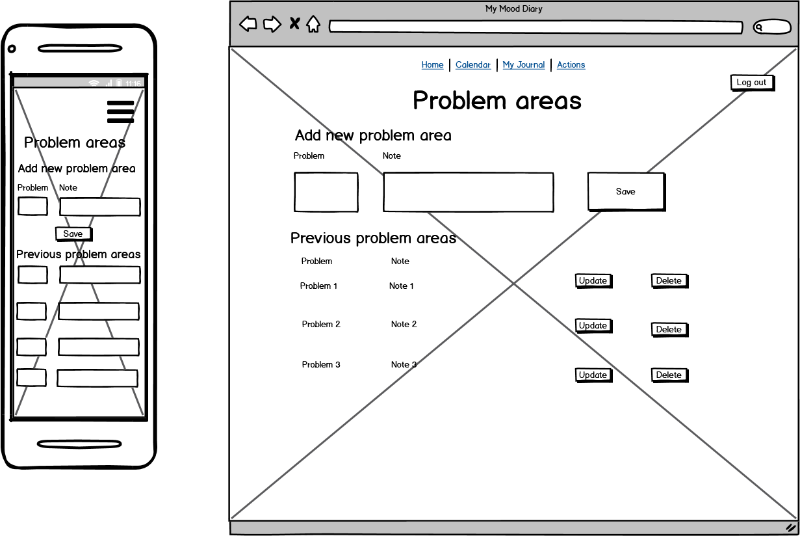
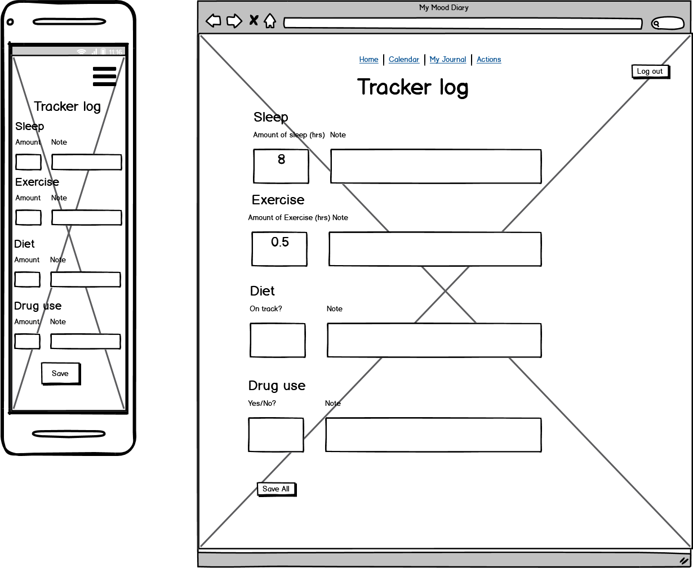
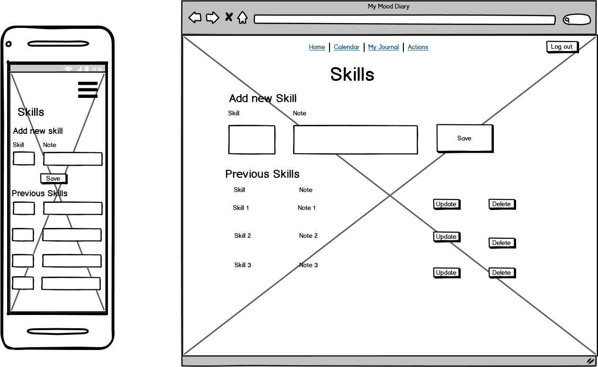
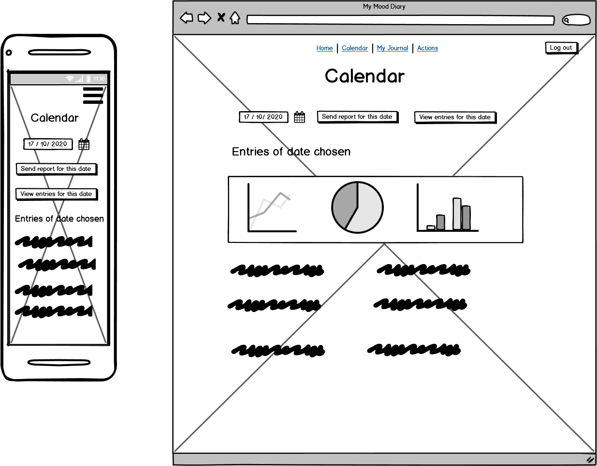

# Overview #

The Trello board for this app can be found here: https://trello.com/b/88ms5t39/my-mood-diary

This app has been developed in consultation with clinical psychologists to track behaviours such as mood, diet, sleep, drug use, exercise as well as problem areas and skills. 

Upon logging in, the user will be prompted to record their mood and emotions at that time which will be monitored and stored in a calendar. 

It also allows users to add a daily journal entry and send a report to their therapist.

## Wireframes ##

Login page


Sign up page


How are you feeling?



Emotions List
https://material-ui.com/components/slider/#discrete-sliders


Actions



My Journal
https://material-ui.com/components/pickers/#datepickers



Problem Areas



Tracker Log



Skills



Calendar

.

## Instructions 

The instructions for Ubuntu 20:

Update repositories on Ubuntu: ```sudo apt-get update```

Clone GitHub repository: ```git clone https://github.com/PandelisT/my-mood-diary.git```

Install python virtual environment: ```apt-get install python3.8-venv```

Create virtual environment: ```python3.8 -m venv venv```

Activate the virtual environment ```source venv/bin/activate```

Install pip: ```python -m pip install --upgrade pip```

Install modules from requirements.txt: ```pip install -r requirements.txt```
