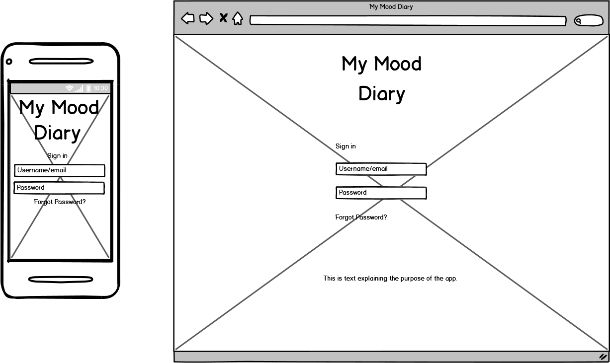
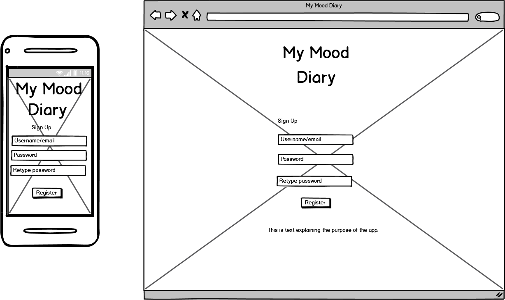

# Overview #

The Trello board for this app can be found here: https://trello.com/b/88ms5t39/my-mood-diary

This app has been developed in consultation with clinical psychologist to track behaviours such as mood, diet, sleep, drug use, exercise as well as problem areas and skills. 

Upon logging in, the user will be prompted to record their mood and emotions at that time which will be monitored and stored in a calendar. 

It also allows users to add a daily journal entry and send a report to their therapist.

## Wireframes ##
Login page

Sign up page
